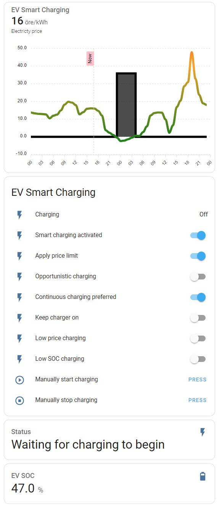

# EV Smart Charging

[![GitHub Release][releases-shield]][releases]
[![License][license-shield]][license]

[![hacs][hacsbadge]][hacs]
[![Project Maintenance][maintenance-shield]][user_profile]
[![BuyMeCoffee][buymecoffeebadge]][buymecoffee]


The EV Smart Charging integration will automatically charge the electric vehicle (EV) when the electricity price is the lowest. The integration requires the [Nordpool](https://github.com/custom-components/nordpool) integration.

The integration calculates the set of hours that will give the lowest price, by default restricted to a continuous set. This calculation is done when the electricity prices for tomorrow is available (typically between shortly after 13:00 CET/CEST and midnight) or when the time of the day is before the configured charge completion time. When the automatic charging has started, changes of settings will not have any effect.

## Requirements
- The [Nordpool](https://github.com/custom-components/nordpool) integration.
- Home Assistant version 2022.7 or newer.

## Features
- Automatic EV charging control based on electrity prices from the [Nordpool](https://github.com/custom-components/nordpool) integration.
- Configuraton of the latest time of the day when the charging should be completed.
- Selection of preference between one continuous charging session or several (possibly more price optimized) non-continuous charging sessions.
- Optional setting of minimum SOC level that should be reached indepently of the electrity price.
- Optional setting to only charge when the electricty price is lower than a specified level (will be ignored if needed by the minimum SOC setting).
- Optional possibility to provide information to the integration about when the EV is connected to the charger.
- Optional possibility to keep the charger on after completed charging, to enable preconditioning before departure, i.e., preheating/cooling can be done from the power grid instead of the battery.
- Automatically detects and connects to the integrations [Volkswagen We Connect ID](https://github.com/mitch-dc/volkswagen_we_connect_id) and [OCPP](https://github.com/lbbrhzn/ocpp). Connnections to other EV and charger integrations can be configured manually.

## Installation

### HACS
1. In Home Assistant go to HACS -> Integrations. Click on the three dots in the upper-right corner and select "Custom repositories". Paste the URL  [ev_smart_charging] into the Repository field. In Category select Integration. Click on ADD.
2. In Home Assistant go to HACS -> Integrations. Click on "+ Explore & Download Repositories" and search for "EV Smart Charging".
3. In Home Assistant go to Settings -> Devices & Services -> Integrations. Click on "+ Add integration" and search for "EV Smart Charging".

### Manual

1. Using the tool of choice open the folder for your Home Assistant configuration (where you find `configuration.yaml`).
2. If you do not have a `custom_components` folder there, you need to create it.
3. In the `custom_components` folder create a new folder called `ev_smart_charging`.
4. Download _all_ the files from the `custom_components/ev_smart_charging/` folder in this repository.
5. Place the files you downloaded in the new folder you created.
6. Restart Home Assistant.
7. In Home Assistant go to Settings -> Devices & Services -> Integrations. Click on "+ Add integration" and search for "EV Smart Charging".

## Configuration

The configuration is done in the Home Assistant user interface.

The first form contains the entities that the integration is interacting with.
Parameter | Required | Description
-- | -- | --
Electricity price entity | Yes | The Nordpool integration sensor entity.
EV SOC entity | Yes | Entity with the car's State-of-Charge. A value between 0 and 100.
EV target SOC entity | No | Entity with the target value for the State-of-Charge. A value between 0 and 100. If not provided, 100 is assumed.
Charger control switch entity | No | If provided, the integration will directly control the charger by setting the state of this entity to 'on' or 'off'.

The second form contains parameters that affects how the charging will be performed. These parameters can be changed after intial configuration in Settings -> Devices & Services -> Integrations.
Parameter | Required | Description
-- | -- | --
Charging speed | Yes | The charging speed expressed as percent per hour. For example, if the EV has a 77 kWh battery and the charger can deliver 11 kW (3-phase 16 A), then set this parameter to 14.3 (11/77*100). If there are limitations in the charging power, it is preferred to choose a smaller number. Try and see what works for you!
Charge completion time | Yes | The lastest time of the day for charging to reach the target State-of-Charge. Note, the idea is to set this to a time that is reasonable in most cases, and not to updated this every day. If `None` is selected, charging will be optimized using all hours with available price information.
Electricity price limit | Yes | If the `apply_price_limit` switch is activated, charging will not be performed during hours when the electricity price is above this limit. NOTE that this might lead to that the EV will not be charged to the target State-of-Charge. Also if the price limit is set to zero, there will be no limitations.
Minimum EV SOC | Yes | The minimum State-of-Charge that should be charged, independently of the electricity price.

## Entities

Entity | Type | Description
-- | -- | --
`sensor.ev_smart_charging_charging` | Sensor | The state is "on" or "off". Can be used with automations to control the EV charger.
`switch.ev_smart_charging_smart_charging_activated` | Switch | Turns the EV Smart Charging integration on and off.
`switch.ev_smart_charging_apply_price_limit` | Switch | Applies the price limit, if set to a non-zero value in the configuration form.
`switch.ev_smart_charging_continuous_charging_preferred` | Switch | If turned on, will as basis schedule one continuous charging session. If turned off, will schedule charging on the hours with lowest electricity price, even if they are not continuous.
`switch.ev_smart_charging_ev_connected` | Switch | Tells the integration that the EV is connected to the charger. Is preferable controlled by automations (see example below). Can avoid problems occuring when the EV is not connected to the charger at the time the charging should start. Using it will also ensure that the `sensor.ev_smart_charging_charging` is set to "off" when the EV is not connected to the charger.
`switch.ev_smart_charging_keep_charger_on` | Switch | If "on", the `sensor.ev_smart_charging_charging` will not turn off after completed charge cycle. The feature is intended to enable preconditioning before departure, i.e., preheating/cooling can be done from the power grid instead of the battery. If this option is used, the feature `Electricity price limit` will be turned off, and vice versa. *NOTE* It is required that `switch.ev_smart_charging_ev_connected` is controlled in a proper way in order for this feature to work. Also, there is an assumption made that the EV itself will stop its charging when reaching the target SOC.
`button.ev_smart_charging_manually_start_charging` | Button | Manually start charging. This is totally independent of the automatic charging.
`button.ev_smart_charging_manually_stop_charging` | Button | Manually stop charging. This is totally independent of the automatic charging.

### Configuration entities

The configuration parameters that affects how the charging will be performed are also available as configuration entities. This means they can be found grouped together in the integration's device view and that they can be controlled by service calls. After reload of the integration, or after restart of Home Assistant, the values will be set to the values set during configuration. For descriptions of each parameter, see the Configuration section above.

Entity | Type | Valid value ranges and service calls
-- | -- | --
`select.ev_smart_charging_charge_completion_time` | Select | Valid options, "00:00", "01:00", ..., "23:00" and "None". Can be set by service call `select.select_option`.
`number.ev_smart_charging_charging_speed` | Number | Valid values min=0.1, step=0.1, max=100. Can be set by service call `number.set_value`.
`number.ev_smart_charging_electricity_price_limit` | Number | Valid values min=0, step=0.01, max=10000. Can be set by service call `number.set_value`.
`number.ev_smart_charging_minimum_ev_soc` | Number | Valid values min=0, step=1, max=100. Can be set by service call `number.set_value`.

## Sensor attributes

The sensor `sensor.ev_smart_charging_charging` has the following attributes.

Attribute | Description
-- | --
`Current price` | The current price from the electricity price entity.
`EV SOC` | The current SOC of the electric vehicle, as reported by the EV SOC entity.
`EV target SOC` | The target SOC of the electric vehicle, as reported by the EV target SOC entity.
`Charging is planned` | `true` if charging is planned, otherwise `false`. Is set to `false` after charging is completed.
`Charging start time` | If charging is planned, the date and time when the charging will start.
`Charging stop time` | If charging is planned, the date and time when the charging will stop.
`Charging number of hours` | If charging is planned, the number of hours that charging will be done. This might be less than the number of hours between the start and stop times, if the `apply_price_limit` switch is activated.
`Raw two days` | The electricty price today and tomorrow from the electricity price entity.
`Charging schedule` | The calculated charging schedule. Can be used by an ApexCharts card to visulize the planned charging, see below.

## Lovelace UI

[ApexCharts Card](https://github.com/RomRider/apexcharts-card) can be used to create the follow type of graph. The black line shows when the automatic charging will be done.

Depending on the price unit used, modify the settings for `unit`, `float_precision` and `color_threshold`. For example, if the price unit `SEK/kWh` is used, change the follow lines in the example below.
```
        unit: ' SEK/kWh'

        float_precision: 2

        color_threshold:
          - value: -1
            color: cyan
          - value: 0
            color: green
          - value: 0.4
            color: orange
          - value: 1
            color: red
          - value: 2
            color: magenta
          - value: 5
            color: black
```


```
type: vertical-stack
cards:
  - type: custom:apexcharts-card
    now:
      show: true
      label: Now
      color: '#ffc0cb'
    locale: en
    header:
      show: true
      title: EV Smart Charging
      show_states: true
    graph_span: 2d
    yaxis:
      - min: ~0
        apex_config:
          forceNiceScale: true
    span:
      start: day
    apex_config:
      legend:
        show: false
      xaxis:
        labels:
          show: true
          format: HH
          rotate: -45
          rotateAlways: true
          hideOverlappingLabels: true
          style:
            fontSize: 10
            fontWeight: 10
    series:
      - entity: sensor.ev_smart_charging_charging
        name: Electricty price
        unit: ' öre/kWh'
        data_generator: >
          return entity.attributes.raw_two_days.map((entry) => { return [new
          Date(entry.start), entry.value]; });
        type: line
        float_precision: 0
        show:
          in_header: before_now
        extend_to: false
        color_threshold:
          - value: -100
            color: cyan
          - value: 0
            color: green
          - value: 40
            color: orange
          - value: 100
            color: red
          - value: 200
            color: magenta
          - value: 500
            color: black
      - entity: sensor.ev_smart_charging_charging
        name: Charging
        data_generator: >
          return entity.attributes.charging_schedule.map((entry) => { return
          [new Date(entry.start), entry.value]; });
        type: area
        color: black
        show:
          in_header: false
        extend_to: false
    experimental:
      color_threshold: true
  - type: entities
    entities:
      - entity: sensor.ev_smart_charging_charging
        name: Charging
      - entity: switch.ev_smart_charging_smart_charging_activated
        name: Smart charging activated
      - entity: switch.ev_smart_charging_apply_price_limit
        name: Apply price limit
      - entity: switch.ev_smart_charging_continuous_charging_preferred
        name: Continuous charging preferred
      - entity: switch.ev_smart_charging_keep_charger_on
        name: Keep charger on
      - entity: button.ev_smart_charging_manually_start_charging
        name: Manually start charging
      - entity: button.ev_smart_charging_manually_stop_charging
        name: Manually stop charging
    title: EV Smart Charging
    show_header_toggle: false
  - type: entity
    entity: sensor.ev_smart_charging_charging
    attribute: EV SOC
    name: EV SOC
    icon: mdi:battery-70
    unit: '%'
```

## Integrating with EVs

### EV SOC entity
If the EV SOC is not available as the state of an entity but as a state attribute, e.g. a sensor called `sensor.my_ev` with an attribute `EV SOC`, then it can be configured to be used by the following three steps.
1. Creating a Number Helper in Setting -> Devices & Services -> Helpers (for example named "SOC" that typically will create an entity `input_number.soc`)
2. Creating an automation that sets the value of this Number Helper with the value of the state attribute.
3. Use the Helper entity `input_number.soc` when providing the `EV SOC entity` in the configuration of this integration.
```
alias: EV SOC
description: ""
trigger:
  - platform: state
    entity_id:
      - sensor.my_ev
    attribute: EV SOC
condition: []
action:
  - service: input_number.set_value
    data:
      value: "{{ state_attr('sensor.my_ev', 'EV SOC') }}"
    target:
      entity_id: input_number.soc
mode: single
```

A lot the functionality in this integration relies on knowing the EV SOC. However, if this information is not available, then it is still possible to use this integration to control a charger with very basic functionality. In this case, create a Number Helper in Setting -> Devices & Services -> Helpers (for example named "SOC" that typically will create an entity `input_number.soc`), and then use this entity when configuring the integration.

For example, if the SOC entity is set 60, the Target SOC entity is set to 100 (or not configured) and the `Charging speed` parameter is set to 10, then there will be 4 hours of charging each night, (100-60)/10 = 4.

### EV Target SOC entity
If the EV Target SOC is available as a state attribute, then a similar solution as for EV SOC above can be used.

If there is no integration that provides the EV Target SOC, one can create a Number Helper in Setting -> Devices & Services -> Helpers (for example named "Target SOC" that typically will create an entity `input_number.target_soc`), and then use this entity when configuring the integration.

## Integrating with chargers
If your charger's integration does not provide a swicth entity that this integration can use for control, then the connection between this integration and your charger's integration can in many cases be made with automations.

Also, if information about the EV being connected to the charger is available, an automation can provide that information to the integration in order to improve the handling of the case when the car is not connected to the charger at the time charging is planned to start.

### Example of automation to start charging
```
alias: EV Smart Charging - Start
description: ""
mode: single
trigger:
  - platform: state
    entity_id:
      - sensor.ev_smart_charging_charging
    from: "off"
    to: "on"
condition: []
action:
  - service: easee.set_circuit_dynamic_limit
    data:
      device_id: "b40f1f45d28b0891fe8d" (replace with your own device id)
      currentP1: 16 (replace with your preferred charging current)
```

Please replace the contents of `action:` with suitable contents for your charger.

### Example of automation to stop charging
```
alias: EV Smart Charging - Stop
description: ""
mode: single
trigger:
  - platform: state
    entity_id:
      - sensor.ev_smart_charging_charging
    from: "on"
    to: "off"
condition: []
action:
  - service: easee.set_circuit_dynamic_limit
    data:
      device_id: "b40f1f45d28b0891fe8d" (replace with your own device id)
      currentP1: 0 (something below 6 to make the charging stop)
```

Please replace the contents of `action:` with suitable contents for your charger.

### Example of automation to inform the integration that the EV is connected to the charger
```
alias: EV Smart Charging - EV connected
description: ""
trigger:
  - platform: state
    entity_id:
      - sensor.ocpp_status_connector
condition: []
action:
  - if:
      - condition: state
        entity_id: sensor.ocpp_status_connector
        state: Preparing
    then:
      - service: switch.turn_on
        data: {}
        target:
          entity_id: switch.ev_smart_charging_ev_connected
    else:
      - if:
          - condition: state
            entity_id: sensor.ocpp_status_connector
            state: Available
        then:
          - service: switch.turn_off
            data: {}
            target:
              entity_id: switch.ev_smart_charging_ev_connected
mode: single
```

[ev_smart_charging]: https://github.com/jonasbkarlsson/ev_smart_charging
[releases-shield]: https://img.shields.io/github/v/release/jonasbkarlsson/ev_smart_charging?style=for-the-badge
[releases]: https://github.com/jonasbkarlsson/ev_smart_charging/releases
[license-shield]: https://img.shields.io/github/license/jonasbkarlsson/ev_smart_charging?style=for-the-badge
[license]: https://github.com/jonasbkarlsson/ev_smart_charging/blob/main/LICENSE
[hacs]: https://github.com/hacs/integration
[hacsbadge]: https://img.shields.io/badge/HACS-Custom-41BDF5.svg?style=for-the-badge
[maintenance-shield]: https://img.shields.io/badge/maintainer-Jonas%20Karlsson%20@jonasbkarlsson-41BDF5.svg?style=for-the-badge
[user_profile]: https://github.com/jonasbkarlsson
[buymecoffeebadge]: https://img.shields.io/badge/buy%20me%20a%20coffee-donate-yellow.svg?style=for-the-badge
[buymecoffee]: https://www.buymeacoffee.com/jonasbkarlsson
