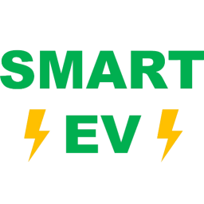

# EV Smart Charging

[![GitHub Release][releases-shield]][releases]
[![License][license-shield]][license]

[![hacs][hacsbadge]][hacs]
[![Project Maintenance][maintenance-shield]][user_profile]
[![BuyMeCoffee][buymecoffeebadge]][buymecoffee]



The EV Smart Charging integration will automatically charge the electric vehicle (EV) when the electricity price is the lowest. The integration requires the [Nordpool](https://github.com/custom-components/nordpool) integration, and can automatically detect the integrations [Volkswagen We Connect ID](https://github.com/mitch-dc/volkswagen_we_connect_id) and [OCPP](https://github.com/lbbrhzn/ocpp). Integrations for other car makers and charger makers can be used with manual configurations.

The integration calculates the continous set of hours that will give the lowest price. This calculation is done when the electricity prices for tomorrow is available (typically between shortly after 13:00 CET and midnight). When the automatic charging has started, changes of settings will no have any effect. The automatic charging is stopped when the end time of the scheduled charging is reached, or when the target SOC is reached.

## Installation

### HACS
1. In Home Assistant go to "HACS" -> "Integrations". Click on the three dots in the upper-right corner and select "Custom repositories". Paste [ev_smart_charging] into the Repository field. In "Category" select "Integration". Click on "ADD".
2. In Home Assistant go to "HACS" -> "Integrations". Click on "+ Explore & Download Repositories" and search for "EV Smart Charging".
3. In Home Assistant go to "Settings" -> "Devices & Services" -> "Integrations" click "+ Add integration" and search for "EV Smart Charging".

### Manual

1. Using the tool of choice open the directory (folder) for your Home Assistant configuration (where you find `configuration.yaml`).
2. If you do not have a `custom_components` directory (folder) there, you need to create it.
3. In the `custom_components` directory (folder) create a new folder called `ev_smart_charging`.
4. Download _all_ the files from the `custom_components/ev_smart_charging/` directory (folder) in this repository.
5. Place the files you downloaded in the new directory (folder) you created.
6. Restart Home Assistant.
7. In Home Assistant go to "Settings" -> "Devices & Services" -> "Integrations" click "+ Add integration" and search for "EV Smart Charging".

## Configuration

The configuration is done in the Home Assistant user interface.

The first form contains the entities that the integration is interacting with.
Parameter | Required | Description
-- | -- | --
Electricity price entity | Yes | The Nordpool integration sensor entity.
EV SOC entity | Yes | Entity with the car's State-of-Charge. A value between 0 and 100.
EV target SOC entity | No | Entity with the target value for the State-of-Charge. A value between 0 and 100. If not provided, 100 is assumed.
Charger control switch entity | No | If provided, the integration will set the state of this entity to 'on' and 'off'.

The second form contain parameters that affects how the charging will be done. These parameters can be changed after intial configuration in "Settings" -> "Devices & Services" -> "Integrations".
Parameter | Required | Description
-- | -- | --
Percent per hour | Yes | The charging speed expressed as percent per hour. For example, if the EV has a 77 kWh battery and the charger can deliver 11 kW (3-phase 16 A), then set this parameter to 14.3 (11/77*100). If there are limitations in the charging power, it is preferred to choose a smaller number. Try and see what works for you!
Typical departure time | Yes | The lastest time tomorrow for the charging to reach the target State-of-Charge. Note, the idea is to set this to a time that is reasonable in most cases, and not to updated this every day.
Electricity price limit | Yes | If non-zero value is provided, charging will not be performed during hours when the electricity price is above this limit. NOTE that this might lead to that the EV will not be charged to the target State-of-Charge.
Minimum EV SOC | Yes | The minimum State-of-Charge that should be charged, independently of the electricity price.

## Entities

Entity | Type | Description
-- | -- | --
`sensor.ev_smart_charging_charging` | Sensor | State "on" or "off". Can be used with automations to control the EV charger.
`switch.ev_smart_charging_smart_charging_activated` | Switch | Turns the EV Smart Charging integration on and off.
`switch.ev_smart_charging_apply_price_limit` | Switch | Applies the price limit, if set to a non-zero value in the configuration form.
`button.ev_smart_charging_manually_start_charging` | Button | Manually start charging. Is totally independent of the automatic charging.
`button.ev_smart_charging_manually_stop_charging` | Button | Manually stop charging. Is totally independent of the automatic charging.

## Lovelace UI

[ApexCharts Card](https://github.com/RomRider/apexcharts-card) can be used to create the follow type of graph.


```
type: vertical-stack
cards:
  - type: custom:apexcharts-card
    now:
      show: true
      label: Now
      color: '#ffc0cb'
    locale: en
    header:
      show: true
      title: EV Smart Charging
      show_states: true
    graph_span: 2d
    yaxis:
      - min: ~0
        apex_config:
          forceNiceScale: true
    span:
      start: day
    apex_config:
      legend:
        show: false
      xaxis:
        labels:
          show: true
          format: HH
          rotate: -45
          rotateAlways: true
          hideOverlappingLabels: true
          style:
            fontSize: 10
            fontWeight: 10
    series:
      - entity: sensor.ev_smart_charging_charging
        name: Electricty price
        unit: ' öre/kWh'
        data_generator: >
          return entity.attributes.raw_two_days.map((entry) => { return [new
          Date(entry.start), entry.value]; });
        type: line
        float_precision: 0
        show:
          in_header: before_now
        extend_to: false
        color_threshold:
          - value: -100
            color: '#039BE5'
          - value: 0
            color: '#0da035'
          - value: 40
            color: '#f39c12'
          - value: 100
            color: '#c0392b'
          - value: 200
            color: '#B600CE'
          - value: 500
            color: '#414141'
      - entity: sensor.ev_smart_charging_charging
        name: Charging
        data_generator: >
          return entity.attributes.charging_schedule.map((entry) => { return
          [new Date(entry.start), entry.value]; });
        type: area
        color: '#0da035'
        show:
          in_header: false
        extend_to: false
    experimental:
      color_threshold: true
  - type: entities
    entities:
      - entity: sensor.ev_smart_charging_charging
        name: Charging
      - entity: switch.ev_smart_charging_smart_charging_activated
        name: Smart charging activated
      - entity: switch.ev_smart_charging_apply_price_limit
        name: Apply price limit
      - entity: button.ev_smart_charging_manually_start_charging
        name: Manually start charging
      - entity: button.ev_smart_charging_manually_stop_charging
        name: Manually stop charging
    title: EV Smart Charging
    show_header_toggle: false
  - type: entity
    entity: sensor.ev_smart_charging_charging
    attribute: EV SOC
    name: EV SOC
    icon: mdi:battery-70
    unit: '%'
```
Depending on the price unit used, modify the settings for `unit`, `float_precision` and `value`.

[ev_smart_charging]: https://github.com/jonasbkarlsson/ev_smart_charging
[releases-shield]: https://img.shields.io/github/v/release/jonasbkarlsson/ev_smart_charging?style=for-the-badge
[releases]: https://github.com/jonasbkarlsson/ev_smart_charging/releases
[license-shield]: https://img.shields.io/github/license/jonasbkarlsson/ev_smart_charging?style=for-the-badge
[license]: https://github.com/jonasbkarlsson/ev_smart_charging/blob/main/LICENSE
[hacs]: https://github.com/hacs/integration
[hacsbadge]: https://img.shields.io/badge/HACS-Custom-41BDF5.svg?style=for-the-badge
[maintenance-shield]: https://img.shields.io/badge/maintainer-Jonas%20Karlsson%20@jonasbkarlsson-41BDF5.svg?style=for-the-badge
[user_profile]: https://github.com/jonasbkarlsson
[buymecoffeebadge]: https://img.shields.io/badge/buy%20me%20a%20coffee-donate-yellow.svg?style=for-the-badge
[buymecoffee]: https://www.buymeacoffee.com/jonasbkarlsson
